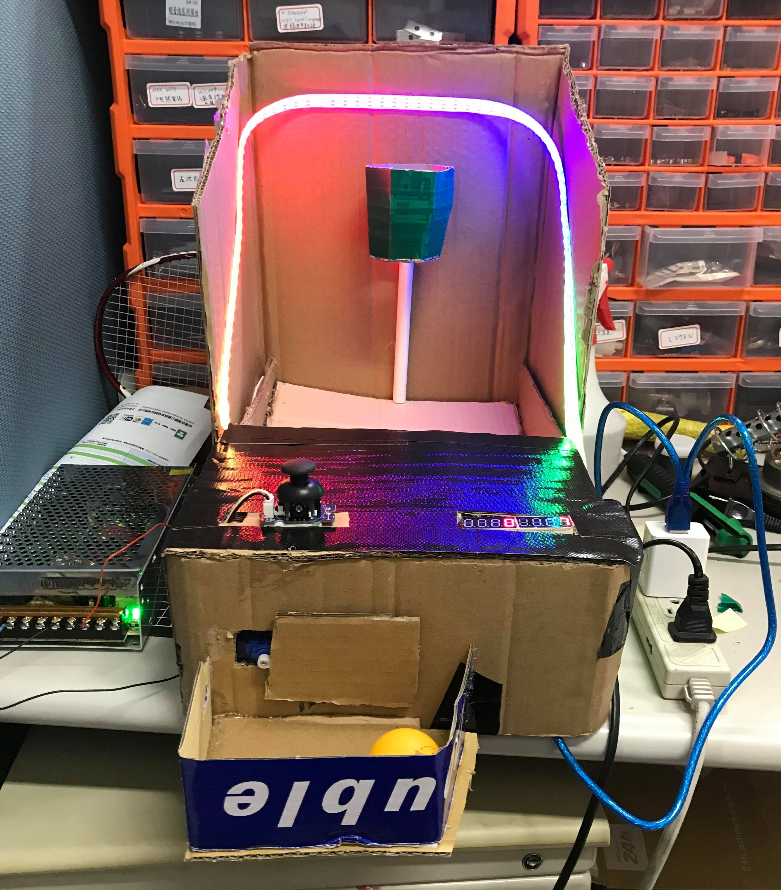
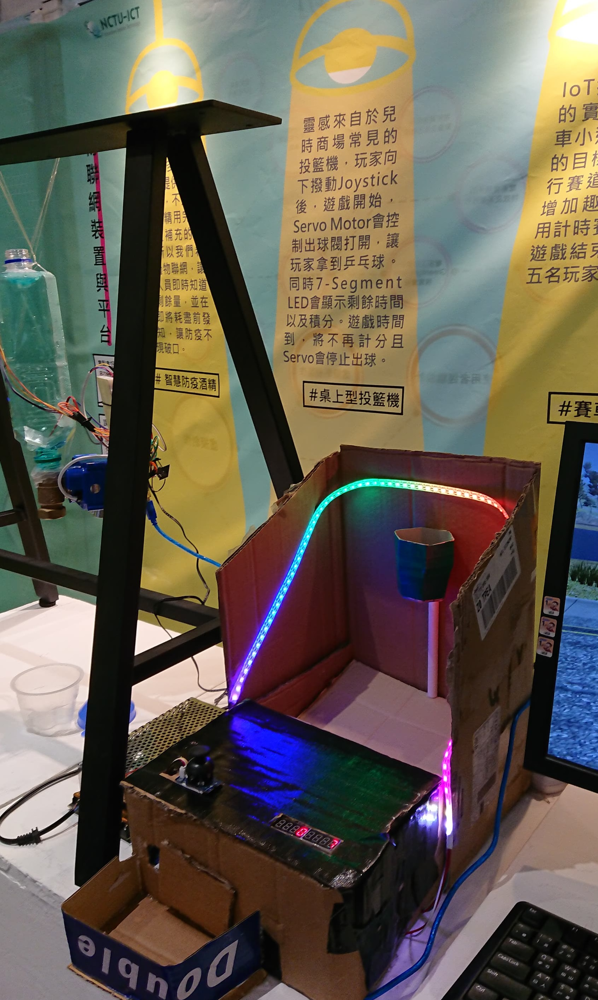

Mini Basketball Arcade
===
Team Members: 

### Introduction
We designed a tabletop version of the popular basketball arcade game.

#### Video

#### Game Flow
1. A user starts the game by pressing the joystick button.
2. The left side of 7-segment LEDs will display a 20-second countdown, and the right-hand side will display the current accumulated scores.
3. At the same time, servo motor will open the ball valve and let the ball roll out for the player to use.
4. When a user successfully shoot into the bucket, the IR Sensor will detect the ball and add one point to the scores. Besides, it will also notify our fancy LED light bar to change its colors.
5. After 20-second countdown, the servo motor will close the ball valve. 

### Environment
- [Arduino IDE](https://www.arduino.cc/en/software)

### Sensors
- Arduino UNO x2
- Analog JoyStick x1
- Servo Motor x1
- 7-Segment LEDs with Max7219 x1
- TCRT5000 IR Sensor x1
- Power Supply x1
- LED Light Bar 1m

### References
- [DIY Cardboard Basketball Arcade Game | DIY Projects](https://www.youtube.com/watch?v=mLh0SP0vriI)
- [Arduino | I2C練習(1)：使用兩個Arduino做溝通](https://hugheschung.blogspot.com/2018/05/arduino-i2c1arduino.html)